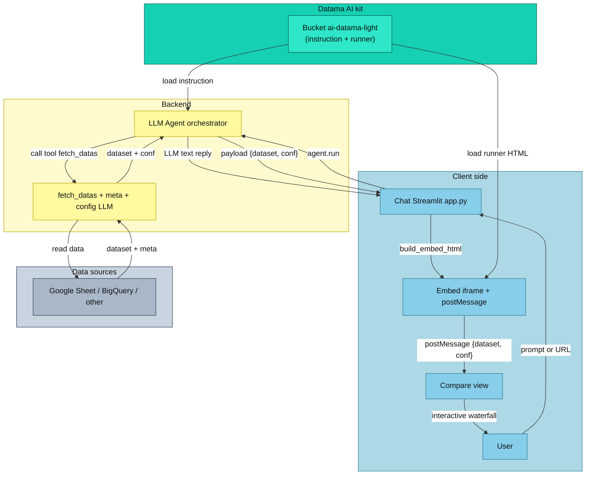

## Architecture and flow – `datama-ai`



**Note** — The **instruction** file (`instruction-runner.ai-toolkit.md`) and the **runner** (`runner.ai-toolkit.html`) are **downloaded from Datama GCS storage** (bucket `ai-datama-light`). The **conf** is **produced by the LLM** from the **meta** and the **user question**, following that instruction file.

---

### `meta`
**Role** — Describes columns (names, types, date format, sample of values) without raw data. The LLM uses it to generate the Compare config; it does not receive the `dataset`.

**Shape** — Object whose keys are column names. Each value: `name`, `type` (`date` / `string` / `int` / `float`), `unique` (list of distinct values), `format` (if date type).

```json
{
  "Date": { "name": "Date", "type": "date", "format": "YYYY-MM-DD", "unique": ["2024-01-01", "2024-01-02"] },
  "Pays": { "name": "Pays", "type": "string", "unique": ["France", "Allemagne"] },
  "CA": { "name": "CA", "type": "float", "unique": [1234.5, 6789.0] }
}
```

---

### `dataset`
**Role** — Raw data (one row = one object). Sent with `conf` to the Light runner to display the view. The LLM does not see it.

**Shape** — Array of objects; keys = column names (aligned with `meta`), values = cells.

```json
[
  { "Date": "2024-01-01", "Pays": "France", "Sessions": 120, "CA": 1234.5 },
  { "Date": "2024-01-02", "Pays": "Allemagne", "Sessions": 200, "CA": 2100.0 }
]
```

---

### `instruction`
**Role** — System prompt for the LLM that generates the Compare config. **Downloaded from Datama GCS storage** (file `instruction-runner.ai-toolkit.md`). The LLM receives this text as instructions and as input: `meta` + the user question (not the `dataset`). The **conf** is produced by the LLM from this prompt, the `meta`, and the user question.

**Shape** — Markdown text describing the expected output: `dimensions`, `metrics`, `steps`, `inputs`, `configuration`, `message`.

---

### `conf`
**Role** — Compare configuration **produced by the LLM** from the **meta** and the **user question**, following the instruction file (see `instruction`). Tells DataMaLight how to read the `dataset` (dimensions, metrics, steps, comparison). Sent with the `dataset` to the runner via `postMessage`.

**Shape** — Object: `dimensions`, `metrics`, `steps` (numerator, denominator, name…), `inputs` (formula, context, start, end, order, totalStepName, metricForClustering…), `configuration` (optional). Example over several lines:

```json
{
  "dimensions": ["Date", "Pays"],
  "metrics": ["Sessions", "CA"],
  "steps": [
    { "numerator": "Sessions", "denominator": "", "name": "Sessions" },
    { "numerator": "CA", "denominator": "Sessions", "name": "CA/Session" }
  ],
  "inputs": {
    "formula": "[1]*[2]",
    "context": "Date",
    "start": ["2024-01-01", "2024-01-15"],
    "end": ["2024-01-16", "2024-01-31"],
    "relative": false,
    "order": "desc",
    "totalStepName": "CA (Total)",
    "totalStepUnit": "",
    "metricForClustering": "CA"
  },
  "configuration": {}
}
```

---

### `light`
**Role** — Front runner (`runner.ai-toolkit.html`): **downloaded from Datama GCS storage** (same bucket as the instruction, Compare path). Receives `dataset` + `conf` via `postMessage` and displays the Compare view. It does not read data sources.

**Shape** — Page served in an iframe. Contract: message `type: "datama-light-payload"` with `dataset` and `configuration` (the `conf`). The client app creates the iframe and sends this payload on load (e.g. via `build_embed_html(dataset, conf)`).